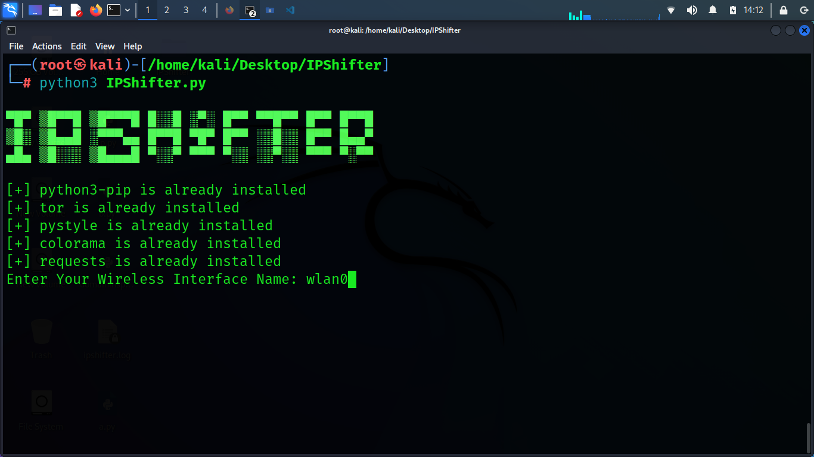
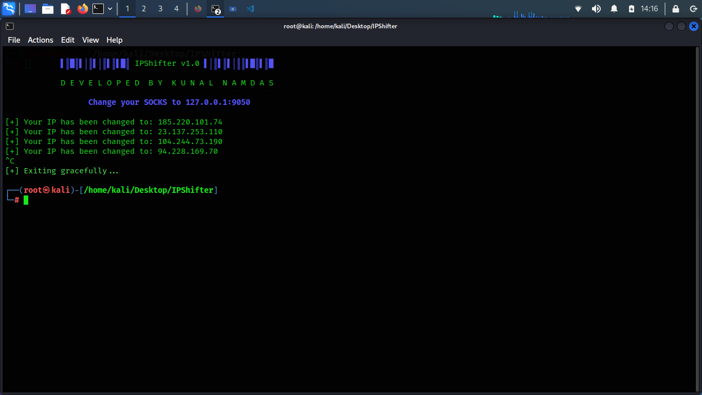

# IPShifter

IPShifter is a Python tool for changing your IP address using TOR, with additional features for network anonymity.






## Features

- Change IP address using TOR network
- Customize IP change frequency and number of changes
- Automatically installs necessary dependencies (Python packages and TOR)
- ASCII art and colorful console output for better user experience

## Installation

### Prerequisites

- Python 3.x
- Linux environment (tested on Ubuntu)

### Dependencies

Install the required Python libraries and TOR:

```bash
sudo apt update
sudo apt install tor python3-pip -y
pip install -r requirements.txt
or......
pip install pystyle colorama requests
```

## Clone the Repository

### Clone the repository to your local machine:

```bash
git clone https://github.com/kunalnamdas/IPShifter.git
cd IPShifter
```

## Usage

### 1.Start the script:

```bash
python ipshifter.py
```

## 2.Follow the on-screen prompts to configure:
- Enter your wireless interface name
- Set the time interval for IP change
- Specify the number of IP changes (0 for infinite)

## 3.Change your SOCKS proxy to 127.0.0.1:9050 as instructed.


## Contributing

Contributions are welcome! Please fork the repository and submit a pull request with your enhancements.


Thank you for checking out IPShifter! If you find this project useful, feel free to star it on GitHub and share it with others. Your support is greatly appreciated.


